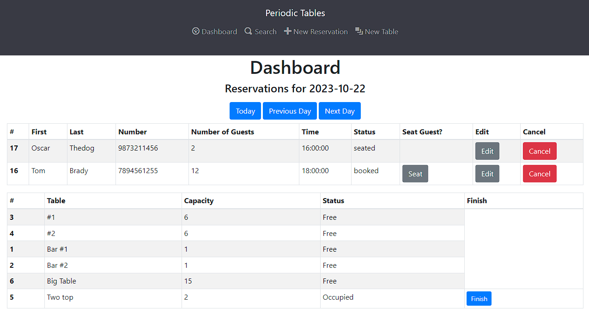

# Restaurant Reservation App

**Live site:** [Restaurant Dashboard](https://restaurant-dashboard-frontend.onrender.com)

This full-stack application, powered by PostgreSQL, Express, React, and Node, empowers restaurant staff to manage reservations. The back end is hosted at [Reservation Backend](https://reservation-backend-63rq.onrender.com).

**Note:** The Render platform may temporarily spin down dormant sites, so it's advisable to visit the backend URL first for a few moments before opening the front-end link. It might take some time.

## Dashboard

The `/dashboard` page:

- Lists reservations for the current date, sorted by time.
- Provides navigation buttons for viewing reservations on other dates.
- Displays error messages from the API.

Each reservation in the list:

- Features a "Seat" button.
- Shows the status as "booked" by default.
- Displays a "Finish" button for occupied tables.
- Allows staff to change the reservation status to "seated" by clicking the "Seat" button.
- Enables staff to mark a table as available by clicking the "Finish" button.

## New Reservation

The `/reservations/new` page:

- Requires information like first name, last name, mobile number, reservation date, time, and party size (minimum of 1).
- Includes a "Submit" button to save a new reservation and navigate to the `/dashboard` for the reservation date.
- Provides a "Cancel" button to return to the previous page.
- Shows error messages for constraints, such as reservations on Tuesdays or in the past, reservations before 10:30 AM or after 9:30 PM, or past date-time combinations.

## New Table

The `/tables/new` page:

- Requires details like table name (at least 2 characters long) and capacity (minimum of 1 person).
- Offers a "Submit" button to save a new table and return to the `/dashboard`.
- Provides a "Cancel" button to return to the previous page.

## Seat Reservation

The `/reservations/:reservation_id/seat` page:

- Requires selecting a table from the available options, considering table capacity.
- Offers a "Submit" button to assign the table to the reservation and navigate to the `/dashboard`.
- Provides a "Cancel" button to return to the previous page.

## Search for a Reservation by Phone Number

The `/search` page:

- Features a search box to enter a customer's phone number.
- Provides a "Find" button to initiate the search.
- Displays matching reservations on the `/search` page, using the same list component as the `/dashboard`.
- Shows "No reservations found" if no records match the search.

## Edit a Reservation

The `/reservations/:reservation_id/edit` page:

- Allows editing of reservations with a "booked" status.
- Offers a "Submit" button to save changes and return to the previous page.
- Provides a "Cancel" button to discard changes and return to the previous page.

## Installation

- Simply clone this repo and run `npm run start:dev` and you will be able to use this on your localhost.
